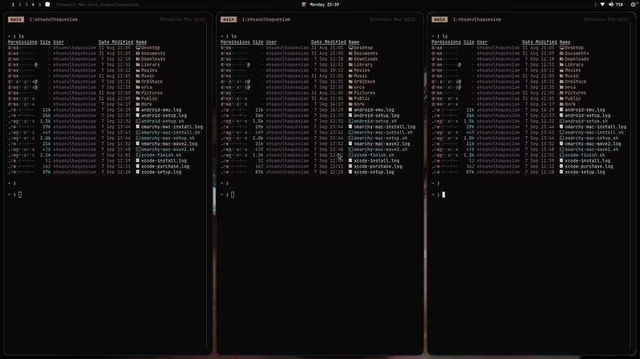
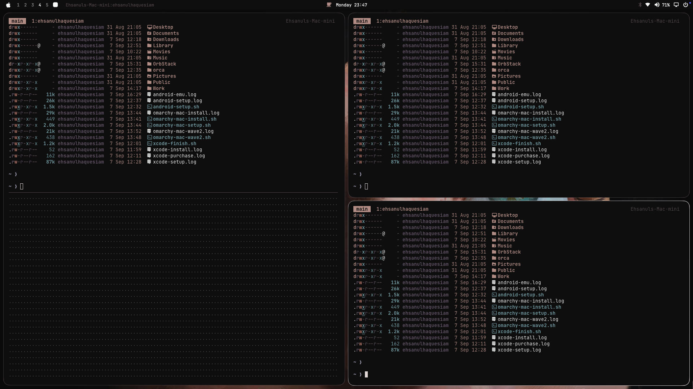
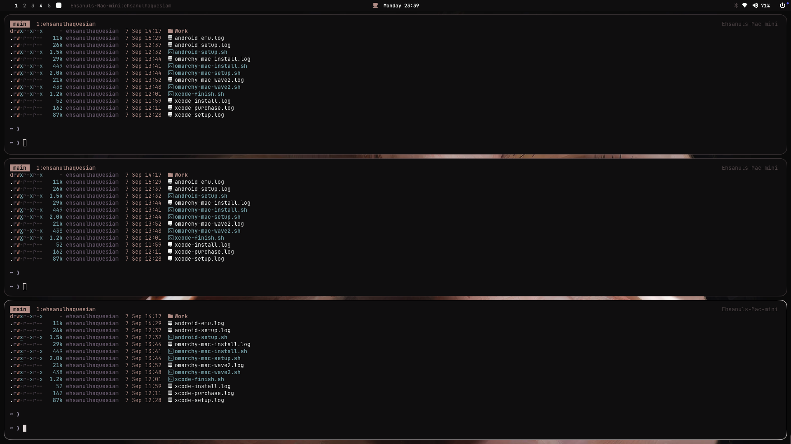
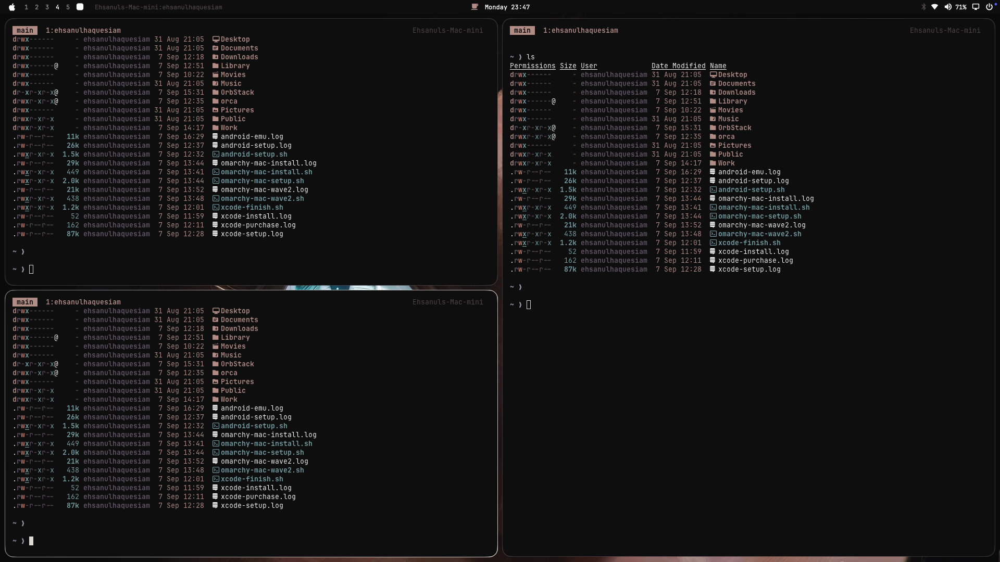
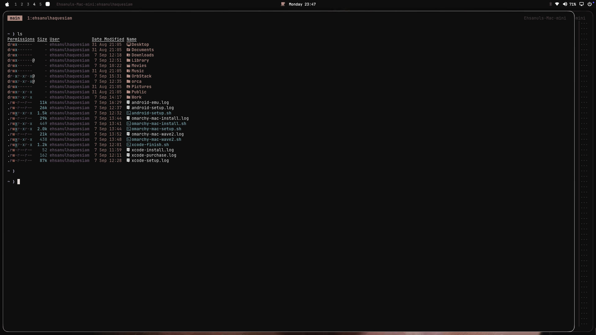

# macarchy

An [Omarchy](https://omarchy.org)-flavoured macOS desktop: Hyprland's window management, keybindings and bar, rebuilt with AeroSpace, skhd, SketchyBar and JankyBorders.

This is not Omarchy running on macOS, and it is not affiliated with the Omarchy project. It recreates Omarchy's look, feel and keymap out of native macOS tools.

142 of Omarchy's 149 mappable default bindings work here (95%). The remaining 7 are listed at the bottom with the reason each one is impossible.

<!-- gallery -->
## Looks like


Workspace switching, split flipping and grouping:



| Three columns | After OPT+J | After OPT+CMD+Left | Accordion |
| --- | --- | --- | --- |
|  |  |  |  |


## The key model

| Omarchy | here | why |
| --- | --- | --- |
| `SUPER` | `Option` (⌥) | on a PC keyboard, put it on the Win key with `omarchy-mac-keyboard-super` |
| `ALT` (Hyprland's secondary) | `Command` (⌘) | |
| `CTRL` | `Control` (⌃) | |

So Omarchy's `SUPER + SHIFT + ALT + F` is `⌥⇧⌘F`.

## Install

```sh
git clone https://github.com/EhsanulHaqueSiam/macarchy.git
cd macarchy
./install.sh
```

That installs Homebrew if missing, runs the `Brewfile`, links every config with GNU stow, applies the macOS defaults, starts the four services and runs the health check.

`install.sh` taps and `brew trust`s the third-party taps first (AeroSpace, SketchyBar, borders, skhd, nightlight, AutoRaise);
Homebrew refuses to load their formulae otherwise and `brew bundle` fails.

Three things macOS will not let a script do:

- **Privacy & Security > Accessibility**: AeroSpace, borders, AutoRaise
- **Privacy & Security > Input Monitoring**: skhd
- **Control Center > Menu Bar Only > Automatically hide and show the menu bar**: Always

Then `omarchy-mac-doctor` should print `all good`.

## Layout

GNU stow packages, one per tool. `.stowrc` points stow at `stow/` with `$HOME` as
the target, so `stow sketchybar` from the repo root needs no flags.

```
macarchy/
├── Makefile              make help / link / doctor / keys / dump
├── install.sh            brew + trust + stow + defaults + services
├── macos-defaults.sh     the macOS settings the rig depends on
├── Brewfile              what this rig needs
├── Brewfile.full         full dump of the machine, for a rebuild
├── .stowrc               --dir=stow --target=~
└── stow/
    ├── aerospace/  .aerospace.toml
    ├── skhd/       .config/skhd/skhdrc
    ├── sketchybar/ .config/sketchybar/{sketchybarrc,theme.sh,plugins/*.sh}
    ├── borders/    .config/borders/bordersrc
    ├── autoraise/  .config/AutoRaise/config
    └── bin/        .local/bin/omarchy-mac-*        (35 helpers)
```

Everything in `$HOME` is a symlink back into this repo, so editing a config in
place is editing the repo. `make relink` after adding a file, `make unlink` to
back the symlinks out without losing anything.

## How it fits together

| piece | owns |
| --- | --- |
| **AeroSpace** | tiling, focus, workspaces. Native commands only, no process spawn |
| **skhd** | anything that launches a program, plus key synthesis (⌥C/⌥V/⌥X) |
| **SketchyBar** | the top bar |
| **JankyBorders** | the active-window border |
| **AutoRaise** | focus follows mouse, Hyprland style |

`~/.aerospace.toml` and `~/.config/skhd/skhdrc` are **strictly disjoint**. A chord bound in both fires twice, so `omarchy-mac-doctor` diffs the two files and fails if they intersect.

## Bindings

`⌥K` opens a searchable cheat sheet generated live from the two config files, so it can never drift. The essentials:

| | |
| --- | --- |
| `⌥1`..`⌥0` | workspace 1-10 |
| `⌥⇧1`..`⌥⇧0` | move window to workspace |
| `⌥⇧⌘1`..`⌥⇧⌘0` | move window there silently |
| `⌥←→↑↓` | focus window |
| `⌥⇧←→↑↓` | swap window |
| `⌥⌘←→↑↓` | stack with that neighbour (this is how you build mixed horizontal/vertical splits) |
| `⌥J` | flip the split horizontal/vertical |
| `⌥W` / `⌥Q` | close window |
| `⌥F` / `⌥⌃F` | fullscreen / tiled fullscreen |
| `⌥T` / `⌥O` | float toggle / pop out |
| `⌥G` / `⌥P` | group (accordion) / tabbed vs stacked |
| `⌥-` `⌥=` | resize (add `⌘` for fine, `⌃` for coarse) |
| `⌥Tab` / `⌥⇧Tab` | next / previous workspace |
| `Alt+Tab` | cycle windows (Omarchy's ALT+TAB; it replaces the macOS app switcher) |
| `⌥S` / `` ⌥` `` | scratchpad |
| `⌥Return` | terminal |
| `⌥Space` | launcher |
| `⌥⇧Space` | swap the bar for the real macOS menu bar |
| `⌥⌘M` | the focused app's File/Edit/View menus |

## Window opening

New windows nest the way Hyprland's dwindle does, rather than becoming another
equal column. Measured on 1920x1080:

```
1 window    1900x1033
2 windows    945x1033   945x1033
3 windows    945x1033   945x512    945x512
4 windows    945x1033   945x511    468x511   468x511
```

`omarchy-mac-dwindle` runs from `on-window-detected` and pulls each new window
into a container with its neighbour. The opposite-orientation normalization
flips that container to the other axis for free, which is what makes the spiral.
It needs no window geometry, which matters because AeroSpace exposes none: the
parent's layout already says which side the new window landed on. Floating apps
skip it, because AeroSpace stops at the first matching `on-window-detected` rule.

Remove the last `on-window-detected` entry in `~/.aerospace.toml` to get plain
sibling columns back.

## The bar

Omarchy's widget set, in Omarchy's order:

```
 1 2 3 4 5  window title        indicators  clock  updates        bluetooth  wifi  audio  display  power
```

Workspaces follow Omarchy's own rules: 1-5 always shown, plus any occupied one up to 10, the focused one drawn as a dot rather than its number, empty ones at half opacity.

Audio, wifi and bluetooth are interactive, standing in for Omarchy's popout panels:

| | left click | right click | scroll |
| --- | --- | --- | --- |
| audio | mute | output device picker | volume |
| wifi | known networks, Wi-Fi power | Network settings | |
| bluetooth | power, connect/disconnect | Bluetooth settings | |

Colours come from the active Omarchy theme (`omarchy-mac-colors` reads its `colors.toml`), so `⌥⇧⌃Space` restyles the bar and the window borders together.

## Other screens

Most of it adapts on its own:

- the bar draws on every display (`display=all`) and the workspace pills read
  `--monitor all`
- `outer.top` is per-monitor, so a built-in MacBook display reserves extra room
  for the notch strip while externals get bar height + gap
- `bordersrc` sets `hidpi` from whether the display is retina
- `make docs` reads the screen width at capture time

Two things to tune by hand if your display differs:

- **Notched MacBook**: the built-in gap is 46. If the bar still collides with the
  notch, raise that number in `[gaps] outer.top`, and consider sketchybar's
  `notch_width` to split the bar around it.
- **Bar height**: `sketchybarrc` uses 26 to match Omarchy. If you change it,
  change `BAR` in `omarchy-mac-gaps` and the `outer.top` numbers to match, or
  windows will slide under the bar.

## Reaching the macOS menu bar

SketchyBar sits at CG level 25, above the menu bar's 24, so the auto-hide reveal is behind it. Menus drop *downward* though, so only the strip of titles is ever hidden.

- `⌘⇧/` Help-menu search finds and runs any menu item
- `⌥⌘M` picks the menu and item through the accessibility API
- `⌥⇧Space` swaps the bar out for the real menu bar

## Deliberate divergences

- Next monitor is `⌃⌘Tab`. Omarchy's `CTRL+ALT+TAB` is the same physical chord as former-workspace.
- Close-all is `⌃⌘⌫`. The Mac key labelled "delete" is backspace.
- `⌥P` has no macOS analog for pseudotile, so it toggles tabbed vs stacked instead.
- `⌥O` floats but cannot pin.
- `⌥⌃X` is Mission Control. Omarchy's dictation toggle has no macOS CLI.
- `PRINT` is `F13`.
- Moving an existing window *into* a workspace leaves it as a plain sibling rather than folding it into the spiral; AeroSpace has no callback for a moved window, only a new one. `⌥⌘arrow` nests it, `⌥b` rebalances.

## Not reproducible on macOS

Window transparency (`⌥⌫`), single-window square aspect, the webcam overlay, laptop-display toggles, scroll-to-switch-workspace, true tabbed groups, Hyprland animations, and F9 push-to-talk dictation (skhd has no key-release event).

## Screenshots

`make docs` captures the bar, the tiling behaviour and a demo GIF into `docs/`,
then inserts the gallery into this README.

It has to run on the Mac itself. macOS gates screen capture behind a Screen
Recording grant that cannot be given to an ssh session from the command line, so
`screencapture` over ssh only ever returns "could not create image from display".

## For agents

`macarchy` is the single entry point, and [AGENTS.md](AGENTS.md) is the contract:
the ownership rule, the traps, and how to verify a change.

```sh
macarchy help              # every subcommand
macarchy doctor            # services, configs, disjointness, macOS settings
macarchy verify            # functional regression suite, non-zero exit on failure
macarchy bindings --json   # all 186 bindings from both configs, machine readable
macarchy keys              # human cheat sheet, generated from the live configs
macarchy reload            # restart all four services
```

## Troubleshooting

`omarchy-mac-doctor` checks all four services, both configs, that they stay disjoint, that AeroSpace callbacks get `USER` (without it SketchyBar stops repainting), that `bordersrc` actually invokes borders, and the macOS settings the rig depends on.
